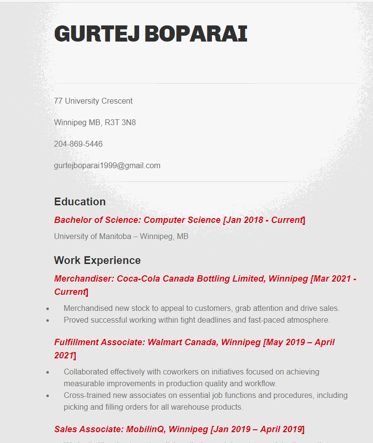
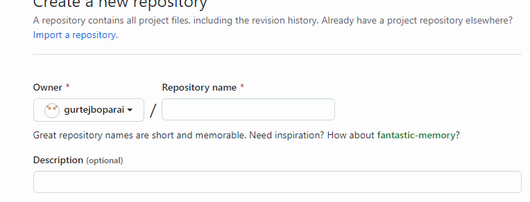
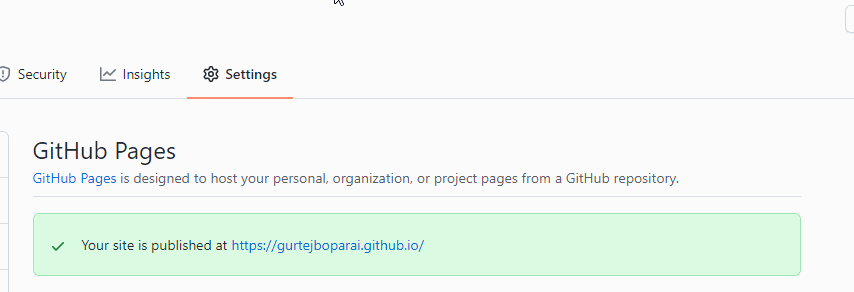

## Host your resume online

------------
### Purpose
To explain how to host a resume on Github Pages.

### Prerequistes
You will need the following:
1) Resume
2) Github account
3) Markdown editor
  
### Instructions
1) Create a new repository in your Github account
- Log in to your Github account
- Click on "New" next to repositories in top left
- Fill in the name for your repository in the standard format: "username.github.io". Note: use the same username as your Github account's username
- Make sure "Public" is checked so that anyone with the link can acess your website
- Click on "Create repository" to create the repository
  

1) Write your resume in markdowwn format
- Write your current resume in markdown fomat using a markdown editor
- Save your resume as "index.md"
3) Upload your resume file to Github repository
- Click on "uploading an existing file" under "Quick setup" in your repository
- Upload your resume named as "index.md" to your repository
- Click on "Commit changes" to save your file
4) Select a theme for your website
- Click on "Settings" inside your repository
- Scroll down to "Github Pages" section at the bottom of the page
- Click on "Check it out here!" to open Github pages tab
- Click on "Choose a theme" under "Theme Chooser"
- Choose any given theme and click on "Select theme"  
- Click on "Commit changes" to save your changes

1) View your website
- Go the link you chose as your reposiroty name "username.github.io" in your browser
- Keep refreshing the tab if you don't see your resume, it might take some time
- Hurray!! success

